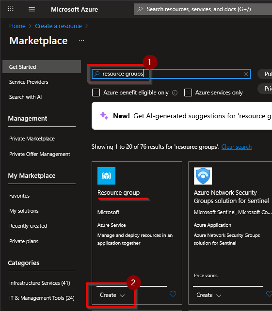
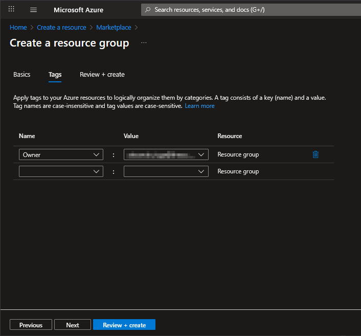
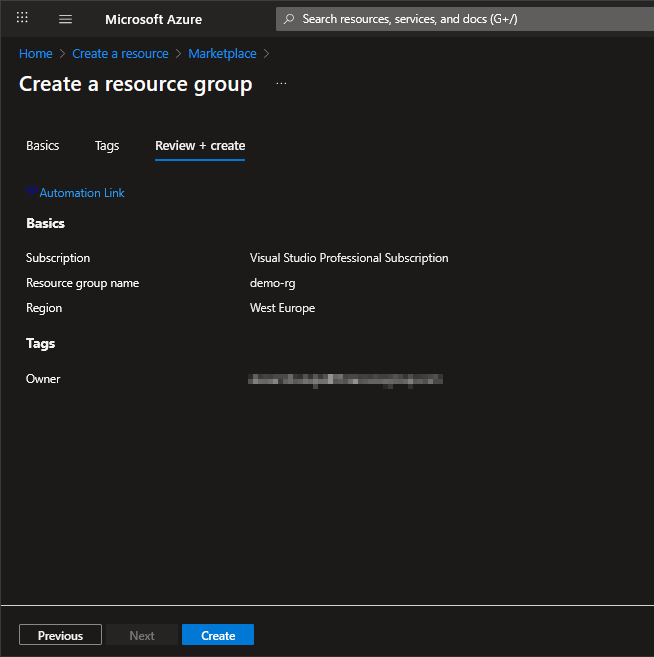
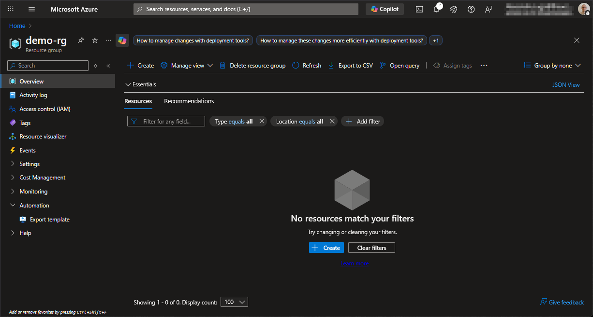

# Create Azure Resource Group

## Step 1 - Create new resource

Go to Azure Portal (https://portal.azure.com) and create a new resource

## Step 2 - Search for "Resource Group"

## Step 3 - Create "Resource Group"

### Basics

- **Subscription**
  - In my case I use the "Visual Studio Professional Subscription"
- **Resource group name**
  - I choose : `demo-rg`
- **Region**
  - I used "West Europe" region.

## Tags

Add tags if necessary. I added the "Owner".

### Review + create

## Step 4 - Create

Click the "Create" button.

## Done

