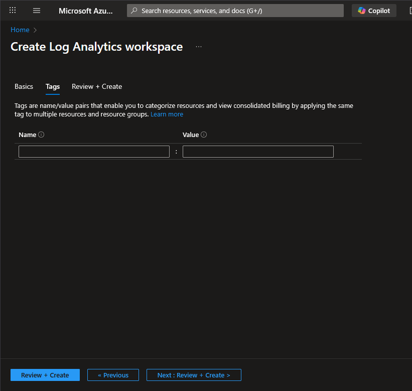
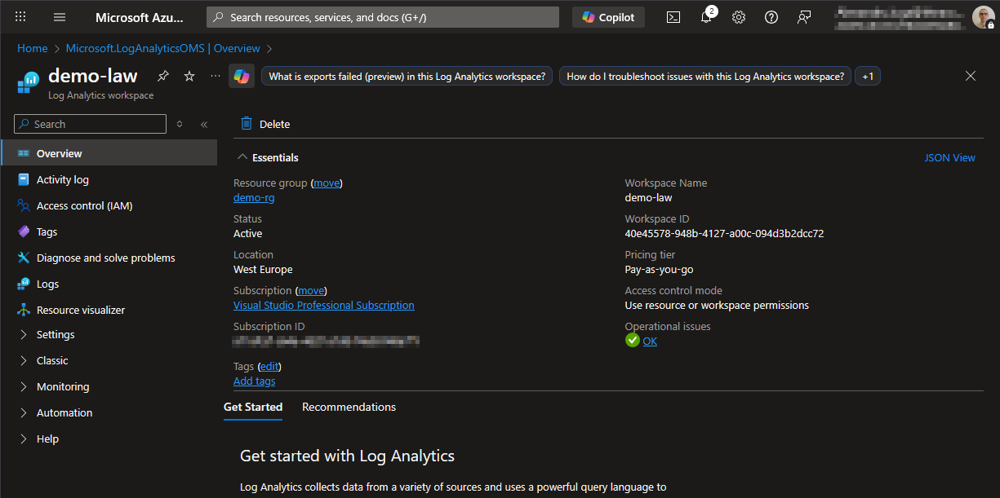

# Create Log Analytics Workspace resource

## Step 1 - Create new resource

Go to Azure Portal (https://portal.azure.com) and create a new resource

## Step 2 - Search for "Log Analytics Workspace"

## Step 3 - Create "Log Analytics Workspace"

### Basics

- **Subscription**
  - In my case I use the "Visual Studio Professional Subscription"
- **Resource group**
  - Choose the previously created `demo-rg`
- **Name**
  - `demo-law`

- **Region**
  - Used the same region as the group: "West Europe".

## Tags

Add tags if necessary.

### Review + create

## Step 4 - Create

Click the "Create" button.

## Done

