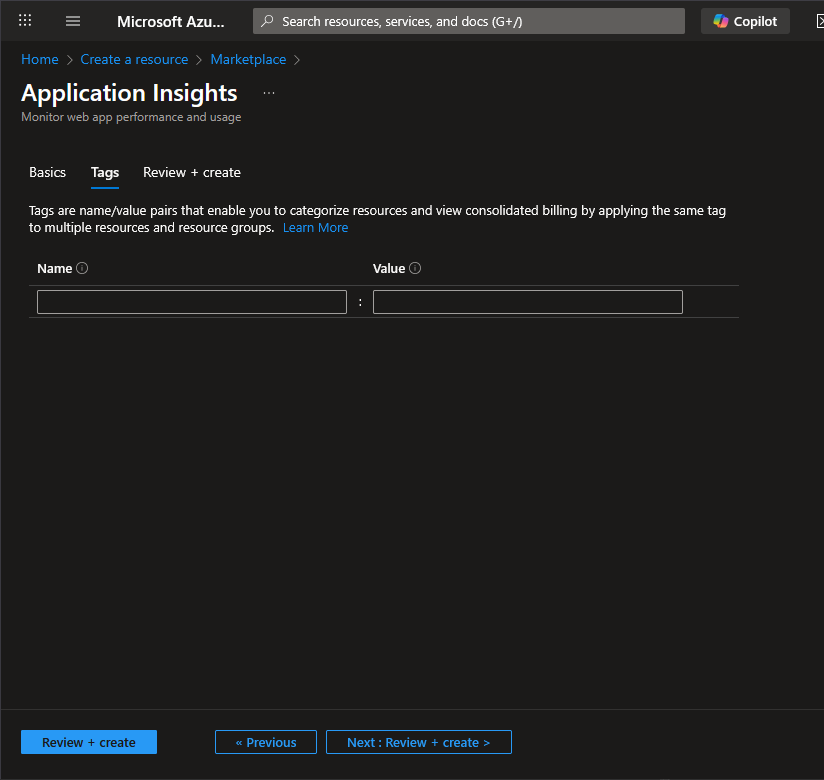
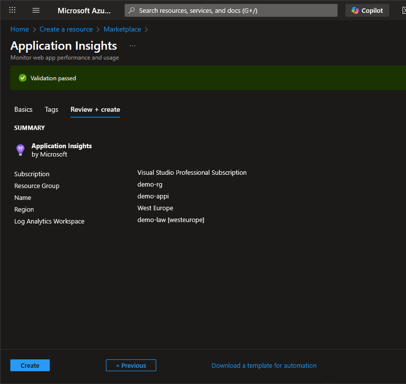

# Create Application Insights

## Step 1 - Create new resource

Go to Azure Portal (https://portal.azure.com) and create a new resource

## Step 2 - Search for "Application Insights"

## Step 3 - Create "Application Insights"

### Basics

- **Subscription**
  - In my case I use the "Visual Studio Professional Subscription"
- **Resource group**
  - Choose the previously created `demo-rg`
- **Name**
  - `demo-appi`

- **Region**
  - Used the same region as the group: "West Europe".
- **Log Analytics Workspace**
  - Choose the previously created `demo-law`

## Tags

Add tags if necessary.

### Review + create

## Step 4 - Create

Click the "Create" button.

## Done

**Note**

- One important information on this page is the "Connection string". This will be needed, later, in the C# application to connect to this specific Application insights resource.