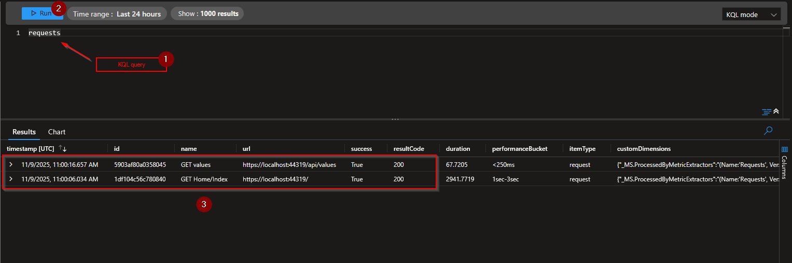

# Query Messages in Azure Portal

## Step 1 - Open Application Insights

In the web browser, open `https://portal.azure.com` and search for your Application Insights resource. In this example it is `demo-appi`:

## Step 2 - Open "Logs" page

## Step 3 - Query for requests

Each time an API endpoint is called, a record is added into the `requests` table from Application Insights.

Use KQL language to interrogate the table:

